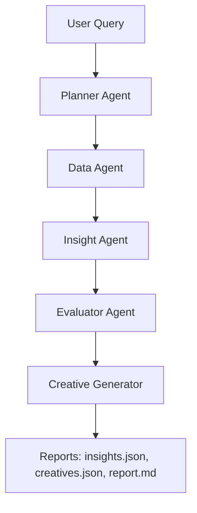

# Agent Architecture & Pipeline Flow  
This document explains how the Facebook Performance Analyst pipeline works internally.  
The system is built using a modular “agentic” design: each agent has one clear responsibility,  
and the Orchestrator coordinates them step-by-step.

---

# 🔷 1. High-Level Pipeline

```
User Query → Planner Agent → Data Agent → Insight Agent → Evaluator Agent → Creative Generator → Final Reports
```

Each agent receives **structured input**, performs a **specific task**, and produces **structured output**  
(JSON dictionaries). The Orchestrator stitches all of this together.

---

# 🔷 2. Agent Roles & Responsibilities

## **1. Planner Agent**
**Purpose:**  
Breaks the user’s request into an executable plan.

**Input:**  
- user_query (string)  
- context (optional)

**Output (JSON plan):**  
```json
{
  "steps": [
    {"id": "load_data", "agent": "data_agent", "params": {"days": 7}},
    {"id": "summaries", "agent": "data_agent", "params": {"group_by": ["campaign_name"]}},
    {"id": "hypotheses", "agent": "insight_agent"},
    {"id": "evaluate", "agent": "evaluator"},
    {"id": "creatives", "agent": "creative_generator"}
  ]
}
```

**Why it exists:**  
This makes the pipeline flexible — different queries trigger different plans.

---

## **2. Data Agent**
**Purpose:**  
Handles **all heavy data processing**.  
Loads the dataset, applies date filters, computes key metrics, and prepares summaries.

**Input:**  
- dataset path (from config)  
- params: time window, grouping, filters

**Output:**  
```json
{
  "summary": {
    "roas_trend": [...],
    "ctr_by_campaign": [...],
    "top_campaigns": [...],
    "bottom_campaigns": [...],
    "spend_distribution": [...]
  }
}
```

**Why it exists:**  
Keeps the LLM focused on reasoning while Python handles all numeric work.

---

## **3. Insight Agent**
**Purpose:**  
Transforms numeric summaries into **interpretable hypotheses**  
(e.g., “ROAS dropped due to creative fatigue in Retargeting”).

**Input:**  
- data summary from Data Agent  
- user question

**Output:**  
```json
[
  {
    "id": "H1",
    "description": "CTR dropped on retargeting campaigns",
    "expected_pattern": "lower CTR in last 7 days vs previous 7 days",
    "metrics_involved": ["ctr", "impressions"],
    "segments": ["audience_type:retargeting"]
  }
]
```

**Why it exists:**  
It turns raw numbers into reasoning paths the Evaluator can verify.

---

## **4. Evaluator Agent**
**Purpose:**  
Tests each hypothesis against the actual data.

**This is where we combine:**
- concrete metric deltas (computed in Python)
- LLM interpretation (confidence scoring)

**Input:**  
- raw DataFrame  
- list of hypotheses  

**Output:**  
```json
[
  {
    "hypothesis_id": "H1",
    "status": "validated",
    "confidence": 0.82,
    "evidence": {
      "ctr_drop": "-38%",
      "affected_campaigns": ["Retargeting_01"]
    }
  }
]
```

**Why it exists:**  
To prevent the system from “hallucinating insights” — every insight must be validated by data.

---

## **5. Creative Generator Agent**
**Purpose:**  
Produces **new creative ideas** based on:
- low-performing campaigns (low CTR, low ROAS)
- high-performing past creatives (to find patterns)
- product/audience information from dataset

**Input:**  
- filtered low-CTR campaigns
- examples of high-performing creatives

**Output:**  
```json
[
  {
    "campaign_name": "UG_Summer",
    "current_ctr": 0.003,
    "suggestions": [
      {
        "headline": "Comfort You Can Feel",
        "primary_text": "Struggling with summer sweat? Try our breathable fabric.",
        "cta": "Shop Now"
      }
    ]
  }
]
```

**Why it exists:**  
The assignment requires "grounded creative recommendations".

---

# 🔷 3. Orchestrator Flow (runner.py)

The Orchestrator executes the plan sequentially:

```
load_config()
↓
initialize_agents()
↓
plan = planner.plan(user_query)
↓
FOR each step in plan:
    if agent == data_agent → run data prep
    if agent == insight_agent → generate hypotheses
    if agent == evaluator → validate hypotheses
    if agent == creative_generator → generate creatives
↓
save outputs → insights.json, creatives.json, report.md
↓
write logs
```

**Why it exists:**  
This keeps the pipeline clean, modular, and easy to extend.

---

# 🔷 4. Data Flow Diagram



---

# 🔷 5. Summary
This architecture ensures:
- clear separation of responsibilities  
- reproducibility via config  
- structured agent communication  
- traceability through logs  
- production-friendly modularity  

This matches Kasparro’s assignment expectations for an **AI-first, modular, agent-driven** pipeline.

